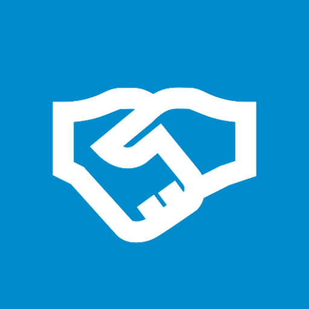

<a name="readme-top"></a>

<br />
<div align="center">
    

  <h3 align="center">Unymos App</h3>

  <p align="center">
   Aplicativo React Native que permite realizar cadastro de proposta de venda e geração de raltórios de cadastro por cidades.
  </p>
</div>

<details>
  <summary>Sumário</summary>
  <ol>
    <li>
      <a href="#sobre-o-projeto">Sobre o Projeto</a>
      <ul>
        <li><a href="#feito-com">Feito com</a></li>
      </ul>
    </li>
    <li>
      <a href="#introdução">Introdução</a>
      <ul>
        <li><a href="#pre-requisitos">Pre-requisitos</a></li>
        <li><a href="#instalação">Instalação</a></li>
      </ul>
    </li>
    <li><a href="#contribuições">Contribuições</a></li>
    <li><a href="#licença">Licença</a></li>
    <li><a href="#contato">Contato</a></li>
  </ol>
</details>

## Sobre o Projeto


O aplicativo foi desenvolvido em React Native/Expo que permite o cadastro de propostas de vendas. Este projeto oferece uma plataforma interativa e acessível, permitindo aos usuários cadastrarem na memoria do celular os dados de cada proposta. Também permite a consulta dos útimos cadastros e geração de relatórios de cadastros por cidade.

### Feito com

Essa lista apresenta as tecnologias e ferramentas utilizadas no projeto.

- [React native](https://reactnative.dev/)
- [Expo](https://expo.dev/)
- [Typescript](https://www.typescriptlang.org/)
- [Zustand](https://zustand-demo.pmnd.rs/)
- [MMKV](https://github.com/mrousavy/react-native-mmkv)
- [Styled-components](https://styled-components.com/)
- [React navigation(Stack)](https://reactnavigation.org/)

#### Outras bibliotecas

- axios
- react-native-svg
- react-native-modal
- react-hook-form

<p align="right">(<a href="#readme-top">voltar ao topo</a>)</p>

## Introdução

Para utilizar o aplicativo, basta clonar ou baixar o repositório e seguir as instruções de instalação disponíveis abaixo. Uma vez instalado, você terá acesso a todas funcionalidades do mesmo sem necessitar se logar.

### Utilizando APK

Voçê pode executar o app em seu celular android acessando o link pelo qrcode disponível abaixo(É preciso ter o aplicativo Expo Go instalado):


### Pre-requisitos

Antes de começar a utilizar o aplicativo certifique-se de ter o ambiente devidamente configurado para executar projetos react native com expo. Caso não tenha configurado basta segiuir o guia a baixo:

- [Ambiente React Native](https://react-native.rocketseat.dev/)

### Instalação

Seguem as instruções de como executar o app:

1. Clone o repositório
   ```sh
   git clone https://github.com/danielsousast/unymos
   ```
2. Instalar as dependências Yarn/NPM

   ```sh
   yarn
   ```

   ou

   ```sh
   npm install
   ```

3. Antes de executar no iOS instale as dependências nativas:

   ```sh
    npx pod-install ios
   ```

4. Para executar execute o seguinte comando:

   ```sh
    yarn ios
   ```

   ou

   ```sh
   yarn android
   ```

<p align="right">(<a href="#readme-top">voltar ao topo</a>)</p>

## Contribuições

Se você tiver alguma sugestão que possa tornar isso melhor, por favor, faça um fork do repositório e crie um pull request. Você também pode simplesmente abrir uma issue com a tag 'melhoria'.

Não se esqueça de dar uma estrela ao projeto!

1. Faça o fork do projeto
2. Crie sua branch (`git checkout -b feature/AmazingFeature`)
3. Faça o commit com as alterações (`git commit -m 'Add some AmazingFeature'`)
4. Faça o push (`git push origin feature/AmazingFeature`)
5. Abra seu pull request

## Licença

Disponibilizado sob a Licença MIT. Consulte `LICENSE.txt` para mais informações.

## Contato

Daniel Sousa - [danielsousast](https://www.linkedin.com/in/danielsousast/)

daniel.sousa.developer@gmail.com

<p align="right">(<a href="#readme-top">voltar ao topo</a>)</p>
